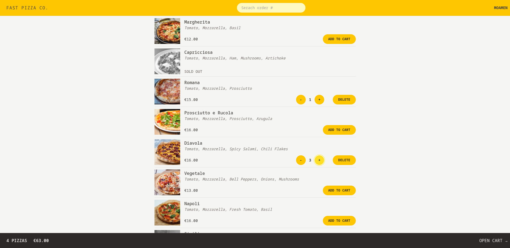

# FAST PIZZA CO. 🍕

**Order Pizza, Fast and Fresh**

A modern pizza ordering application built with React, Redux Toolkit, and React Router. Order your favorite pizzas with real-time cart management, priority delivery options, and geolocation-based address filling.



---

## 📋 Table of Contents

- [Overview](#-overview)
- [Why Fast Pizza Co.?](#-why-fast-pizza-co)
- [Target Audience](#-target-audience)
- [Features](#-features)
- [Technical Stack](#-technical-stack)
- [Usage](#-usage)
- [Future Improvements](#-future-improvements)
- [License](#-license)

---

## 🎯 Overview

Fast Pizza Co. is a full-featured pizza ordering web application that demonstrates modern React development practices. It provides a seamless user experience for browsing menus, managing cart items, and placing orders with optional priority delivery.

The application is designed to be:

- **Fast**: Optimized performance with React 19 and Vite
- **User-Friendly**: Intuitive interface with responsive design
- **Feature-Rich**: Cart management, geolocation, order tracking
- **Scalable**: Redux Toolkit for predictable state management

---

## 🤔 Why Fast Pizza Co.?

This project was built to:

1. **Master Modern React**: Implement React 19 features and best practices
2. **Learn Redux Toolkit**: Understand global state management with Redux
3. **Practice React Router**: Build complex routing with loaders and actions
4. **Real-World Application**: Create a production-ready e-commerce flow
5. **UI/UX Design**: Craft a polished interface with Tailwind CSS

The application simulates a real pizza ordering system with features like:

- Dynamic menu loading
- Real-time cart updates
- Geolocation-based address filling
- Order status tracking
- Priority delivery options

---

## 👥 Target Audience

Fast Pizza Co. is designed for:

- **React Developers**: Learning advanced React patterns and Redux
- **Students**: Studying modern web development and state management
- **Portfolio Projects**: Demonstrating full-stack capabilities
- **Pizza Lovers**: Anyone who wants to order pizza quickly! 🍕

---

## ✨ Features

### Core Functionality

- ✅ **Browse Menu**: View available pizzas with images, ingredients, and prices
- ✅ **Cart Management**: Add, remove, and update pizza quantities
- ✅ **Real-time Cart Overview**: Sticky footer showing cart total and item count
- ✅ **Order Creation**: Simple checkout process with form validation
- ✅ **Order Tracking**: Search and view order status by ID
- ✅ **Priority Delivery**: Optional expedited delivery for 20% extra
- ✅ **Geolocation**: Auto-fill delivery address using browser location
- ✅ **Responsive Design**: Optimized for mobile, tablet, and desktop

### User Experience

- 🚀 **Fast Navigation**: Instant page transitions with React Router
- 💾 **Persistent Cart**: Cart state maintained across navigation
- 🔍 **Order Search**: Quick order lookup by order ID
- 📱 **Mobile-First**: Fully responsive Tailwind CSS design
- ⚡ **Loading States**: Visual feedback during data fetching

---

## 🛠 Technical Stack

### Frontend

- **React 19.2.0**: Latest React features with StrictMode
- **Redux Toolkit 2.11.2**: Simplified Redux with modern API
- **React Router DOM 7.10.1**: Declarative routing with loaders/actions
- **Tailwind CSS 4.1.18**: Utility-first CSS framework
- **Vite 7.2.4**: Next-generation build tool

### Development Tools

- **ESLint**: Code quality and consistency
- **Prettier**: Code formatting with Tailwind plugin
- **React Developer Tools**: Redux and React debugging
- **SWC**: Fast React refresh and builds

### API Integration

- **Pizza API**: Jonas Schmedtmann's React Fast Pizza API
- **Geocoding API**: BigDataCloud reverse geocoding service

### Architecture

```
┌─────────────┐         ┌─────────────┐         ┌─────────────┐
│   React UI  │ ───────▶│   Redux     │ ───────▶│  API Layer  │
│  Components │  Action │    Store    │  Fetch  │  (External) │
└─────────────┘         └─────────────┘         └─────────────┘
       │                       │
       │                       ▼
       │                 ┌──────────────┐
       └────────────────▶│ React Router │
            Navigate     │   Loaders    │
                        └──────────────┘
```

---

## 🚀 Usage

### Getting Started

1. **Enter Your Name**: On the home page, enter your name to begin
2. **Browse Menu**: Click "Start ordering" to view available pizzas
3. **Add to Cart**: Click "Add to cart" on any pizza you like
4. **Manage Cart**: Use +/- buttons to adjust quantities or delete items
5. **Checkout**: Click "Order pizzas" when ready
6. **Fill Details**: Enter phone number and delivery address
7. **Optional Priority**: Check the box for priority delivery (+20%)
8. **Place Order**: Submit and receive your order ID

### Order Tracking

1. **Search Order**: Use the search bar in the header
2. **Enter Order ID**: Type your order ID (e.g., IIDSAT)
3. **View Status**: See order details, estimated delivery, and items

### Using Geolocation

1. **Go to Checkout**: Navigate to "Order pizzas"
2. **Click "Get Position"**: Allow browser location access
3. **Auto-Fill**: Address field populates automatically
4. **Verify**: Check and correct if needed

---

## ⚡ Performance Optimizations

1. **Code Splitting**: React Router lazy loading (if implemented)
2. **Redux Toolkit**: Optimized re-renders with Immer
3. **Vite**: Fast HMR and optimized builds
4. **SWC**: Faster transpilation than Babel
5. **Tailwind JIT**: Only used CSS classes in production

---

## 🚧 Future Improvements

### Phase 1 (Short-term)

- [ ] User authentication (login/register)
- [ ] Payment integration (Stripe/PayPal)
- [ ] Order history for logged-in users
- [ ] Favorites/saved addresses
- [ ] Pizza customization (toppings, size)

### Phase 2 (Medium-term)

- [ ] Real-time order tracking with WebSockets
- [ ] Push notifications for order updates
- [ ] Admin dashboard for managing menu
- [ ] Discount codes and promotions
- [ ] Customer reviews and ratings

### Phase 3 (Long-term)

- [ ] Mobile app (React Native)
- [ ] Multi-language support (i18n)
- [ ] Dark mode
- [ ] Social media integration
- [ ] Loyalty program and rewards

---

## 🐛 Known Issues

- Geolocation may not work in some browsers without HTTPS
- Phone validation regex may not cover all international formats
- Order search case-sensitive (requires exact ID)

---

## 📄 License

This project is licensed under the MIT License - see the [LICENSE](LICENSE) file for details.

---

## 👨‍💻 Author

**[Moamen Ashraf]**

- GitHub: [MomenAshraf5](https://github.com/MomenAshraf5)
- Email: moamenashraf533@gmail.com
- LinkedIn: [MoamenAshraf](https://linkedin.com/in/momen-ashraf)

---

## 🙏 Acknowledgments

- [Jonas Schmedtmann](https://twitter.com/jonasschmedtman) for the React course and API
- React team for amazing documentation
- Redux Toolkit team for simplifying Redux
- Tailwind CSS for the utility-first approach

---

**⚡ Built with passion for React and Pizza 🍕**

_Note: This is an educational project. The API is provided by Jonas Schmedtmann's React course._
